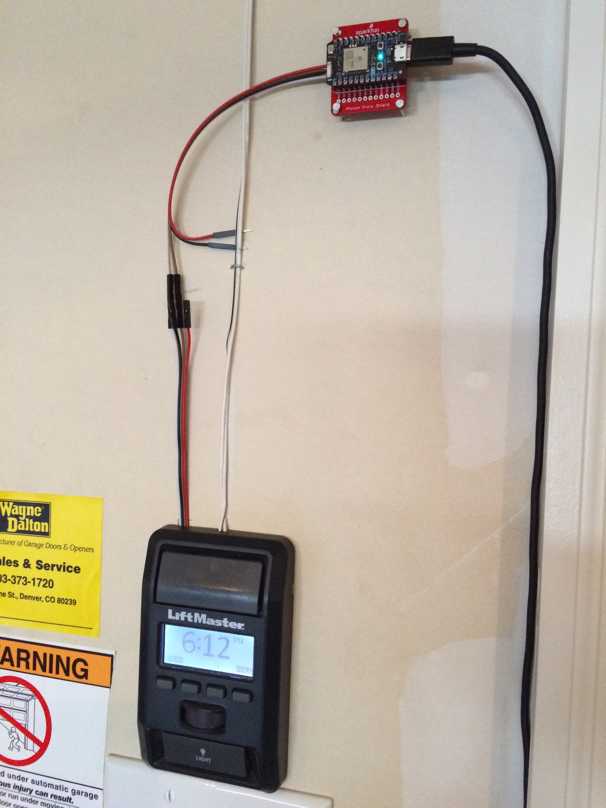

# Alexa Garage

## Overview
Internet, Voice and iOS control for my garage door opener using AWS Lambda, Amazon Echo, and Particle Photon.

There are 3 parts to this project. Number 1 is the hardware and firmware required to interface with the garage controller.
Obviously this is required to make it work. Number 2 and 3 are different ways to control that hardware, and can be
used independently. The iOS app is not dependent on the Alexa Skill, neither is the Alexa Skill dependent on the iOS app.
They both use the same method of triggering the hardware/firmware - the Particle Cloud API. The firmware on the photon exposes
a cloud function - `garage`. In order to run the code in this function, you can send the corresponding REST API call as outlined
in the [Particle Docs](https://docs.particle.io/reference/api/) to hit this custom API endpoint and trigger our custom `garage`
function exposed in the firmware. This then will electronically close the switch contacts of the garage door button - Opening and
closing it.

1. [Photon Firmware](https://github.com/jasonpilz/alexa_garage/blob/master/firmware/garage_button.ino) - Written in C and uploaded to the photon using Particle Dev or
Particle Build.

2. [Alexa Skill](https://github.com/jasonpilz/alexa_garage/tree/master/ASK/src) - Written in Node.js (version 4.3) and hosted as a function on [AWS Lambda](https://aws.amazon.com/lambda/).

3. [iOS Application](https://github.com/jasonpilz/alexa_garage/tree/master/iOS/AlexaGarage) - Very basic iOS app with 1 button that will trigger the door. Written in Swift and installed on your iOS device.

## Interaction Model

Interaction with Alexa can be made with the [following commands](https://github.com/jasonpilz/alexa_garage/blob/master/ASK/speechAssets/SampleUtterances.txt):

**Help**
>"Alexa, ask garage for help"

**Open the garage door**
>"Alexa, tell garage door to open."

**Close the garage door**
>"Alexa, tell garage door to close."

## Alexa Skill Setup
#### AWS Lambda Setup

1. Go to the [AWS Console](https://console.aws.amazon.com) and click on the Lambda link. Note: ensure you are in us-east (N. Virginia) or you won't be able to use Alexa with Lambda.
2. Click on the Create a Lambda Function or Get Started Now button.
3. Under 'Select Blueprint', click 'Skip'.
4. Name the Lambda Function `Garage`.
5. Select runtime of `Node.js 4.3`
6. Go to the the [src directory](https://github.com/jasonpilz/alexa_garage/tree/master/ASK/src), select all files and then create a zip file, make sure the zip file does not contain the src directory itself, otherwise Lambda function will not work.
7. Upload the .zip file to the Lambda.
8. Keep the Handler as index.handler (this refers to the main js file in the zip).
9. Create a basic execution role and click 'Allow'. Click 'Next', then 'Create function'.
10. Return to the main Lambda page, and click on 'Event sources' -> 'Add event source'.
11. Choose Alexa Skills Kit and click 'Submit'.
12. Click on your Lambda function name and copy the ARN to be used later in the Alexa Skill Setup.

#### Alexa Skill Setup

1. Go to the [Amazon Developer Console](https://developer.amazon.com/edw/home.html#/), click 'Get Started' under Alexa Skills Kit, then click 'Add a New Skill'.
2. Fill in `Garage` as 'Name', and `garage` as 'Invocation Name', this is the word you will say to activate the particle function, and the following spoken arguments will determine which command is triggered.
3. Select the Lambda ARN for the skill Endpoint and paste the ARN copied from above. Click Next.
4. Copy the Intent Schema from the included [IntentSchema.json.](https://github.com/jasonpilz/alexa_garage/blob/master/ASK/speechAssets/IntentSchema.json)
5. Copy the Sample Utterances from the included [SampleUtterances.txt.](https://github.com/jasonpilz/alexa_garage/blob/master/ASK/speechAssets/SampleUtterances.txt) Click Next.
6. Under "Endpoint", paste in the ARN you copied from the last step of the Lambda setup
and click the 'Lambda ARN' radio button. Click 'Next'.
7. [Optional] go back to the skill Information tab and copy the `Application Id`. Paste the appId into the `index.js` file for the variable `APP_ID`,
then update the lambda source zip file with this change and upload to lambda again, this step makes sure the lambda function only serves request from authorized source.
8. You are now able to start testing your sample skill! You should be able to go to the [Echo webpage](http://echo.amazon.com/#skills) and see your skill enabled.
9. In order to test it, try to say some of the Sample Utterances from the Examples section below.
10. Your skill is now saved and once you are finished testing you can continue to publish your skill.

## iOS App Setup
[WIP]

## Hardware
[WIP]

### Parts List

* Particle Photon (x1)
* Optocoupler (x1)
* 220 ohm resistor (x1)
* [Optional] Sparkfun Protoshield (x1)
* [Optional] Voltage regulator (x1, 5V, if powering photon from VIN pin)

### Description

### Diagram
<!--  -->

### Pics

## Amazon Resource Links
* [Getting Started](https://developer.amazon.com/public/solutions/alexa/alexa-skills-kit/getting-started-guide)

* [Create a New Lambda Function](https://developer.amazon.com/public/solutions/alexa/alexa-skills-kit/docs/developing-an-alexa-skill-as-a-lambda-function)

* [Define the Voice Interface](https://developer.amazon.com/public/solutions/alexa/alexa-skills-kit/docs/defining-the-voice-interface)
